## Problem Statement:

> 5) Network Log Analysis: Determine Compromised System  
Difficulty: 2/5  
> The attacks don't stop! Can you help identify the IP address of the malware-infected system using these Zeek logs? For hints on achieving this objective, please visit the Laboratory and talk with Sparkle Redberry.

td:lr Answer: **ntdsutil**

===============================================================================
## Solution(hint):

Let's visit Sparkle Redberry at _laboratory_ for the hint.

Spark wants to restart the laser by changing the configuration.

hint given for this sub-problem:

> [SANS' PowerShell Cheat Sheet](https://blogs.sans.org/pen-testing/files/2016/05/PowerShellCheatSheet_v41.pdf

Start up the terminal:  
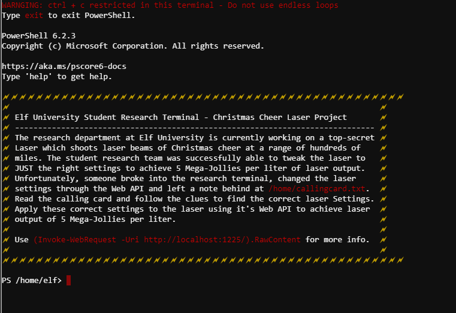

Use following command to check for more info on the laser:  
`(Invoke-WebRequest -Uri http://localhost:1225/).RawContent`:  
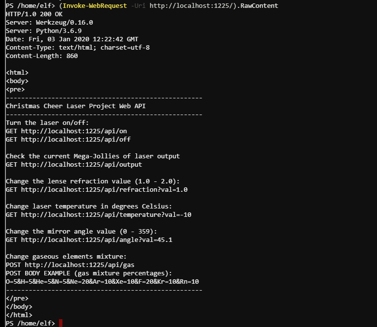

We need to change 4 variables: refraction, temperature, angle and gas.

First clue:  
`type /home/callingcard.txt`  
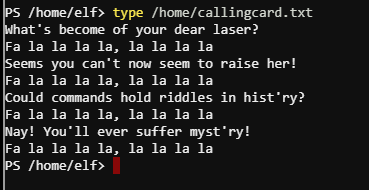

`history | Format-Table -Autosize -Wrap`:  
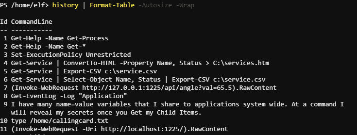

Look for environment variables. No clue in standard variables:  
`Get-ChildItem env: | Format-Table -Wrap`  
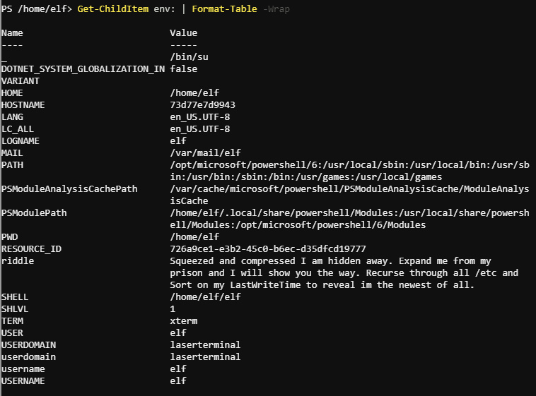

Riddle: Do a -Recurse on all /etc files, and sort to find the newest LastWriteTime:  
`dir /etc -Recurse | Sort-Object -Property LastWriteTime`:  
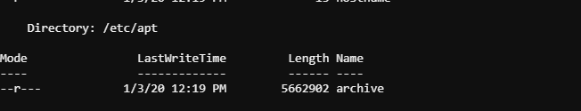

Unzip archive file in `/home/elf`:  
`Expand-Archive /etc/apt/archive -DestinationPath /home/elf`  
`cd /home/elf/refraction`  
`chmod +x runme.elf`  
`./runme.elf`  --get refraction?val=1.867

2nd Clue:  
`type riddle`:  
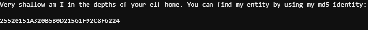

`$hash = type /home/elf/refraction/riddle | Select-String -Pattern "255"` --saves hash as a variable  
`Get-ChildItem -Path /home/elf/depths -Recurse -File | Get-FileHash -Algorithm MD5 | Format-Table -Wrap -AutoSize | Out-String -Stream | Select-String -Pattern $hash`  
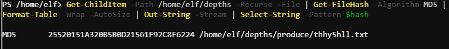

`$file1=/home/elf/depths/produce/thhy5hll.txt"  
`type $file1` --get temperature?val=-33.5  

3rd clue:  
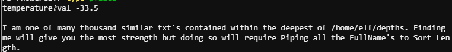

`Get-ChildItem /home/elf -Recurse -File | Sort-Object -Property Length`  --will find the txtfile with the deepest directory length `0jhj5xz6.txt`  
`$file2 = Get-ChildItem depths -Recurse -File -Name "0jhj*.txt"` -- register filepath as a variable  
`type $file2`:  
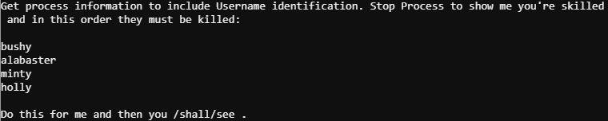

Kill process in order:  
`Get-Process -IncludeUserName`  
`Stop-Process -id 24`  --id might differ
`Stop-Process -id 25`  --id might differ
`Stop-Process -id 28`  --id might differ
`Stop-Process -id 29`  --id might differ
`type /shall/see`:  
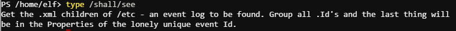

`cd /etc`  
`$file = Get-ChildItem /etc -File -Recurse -Name "*.xml"` --event log found  

