## Problem Statement:

> 7) Get Access To The Steam Tunnels  
> Difficulty: 3/5  
> Gain access to the steam tunnels. Who took the turtle doves? Please tell us their first and last name. For hints on achieving this objective, please visit Minty's dorm room and talk with Minty Candy Cane.

td:lr Answer: **Krampus Hollyfeld**

===============================================================================
## Solution(hint):

First let's visit Minty Candy Cane at dormitory for the hint.  
She wants us to try out this old game she found on a 5 1/4" floppy disk.

hint given for this sub-problem:

> [Web Apps: A Trailhead](https://youtu.be/0T6-DQtzCgM)

Let's get into the terminal and look at the game:

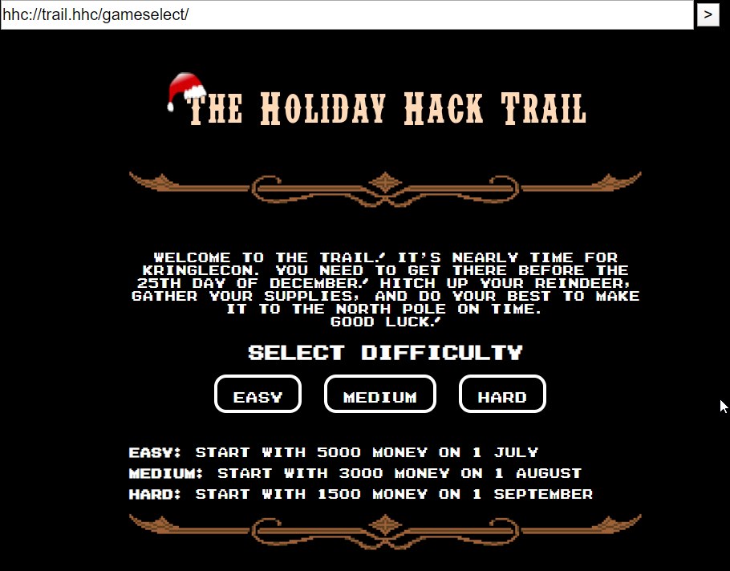

This is the main page of the trail challenge game when first clicked at the terminal beside Minty Candy Cane.

> Generally we should just play the game normally and understand how it works and what the objective of the game is.  
> How to play and win the game via normal approach will not be explained here. Instead, we will discuss how to win this game of each difficulty (easy, medium, hard) by exploiting the poorly handled web app of this game.

After understanding how the game works, we should look at the Page source to find any interesting information.

`View Page Source`

If we look carefully, we should be able to find 3 commented sections as shown:

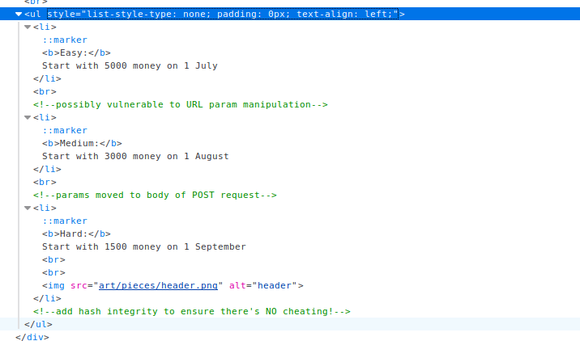

Looks like they are hints provided for each level of difficulty of the game.

So let's tackle the first difficulty (easy) first.

On entering the game, we should be able to see the following:

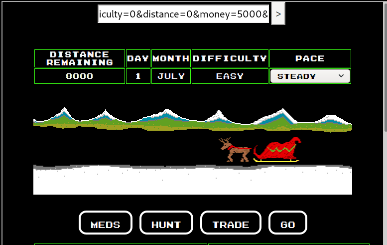

Notice that there is a text field at the top which seemingly looks like a URL containing several terms and values related to the game.

As the game hinted on manipulating URL parameters, possible we can change the value in this URL string and see if we can complete the game in one step. 

We can navigate to the term `distance=0` and then change the distance to 8000, which is the distance required to cover to win the game, then press `GO`:

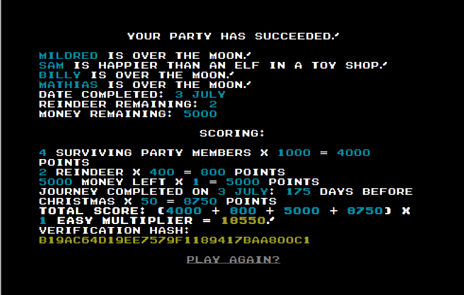

So we got the easy mode without effort. Next let's try the medium difficulty, which also presents us with the same starting page, but this time there's no parameters to manipulate at the top.

As the hint says: they have moved the params to the BODY request.  
If we look into the page source again, we should be able to find hidden value in one of the container tags: 

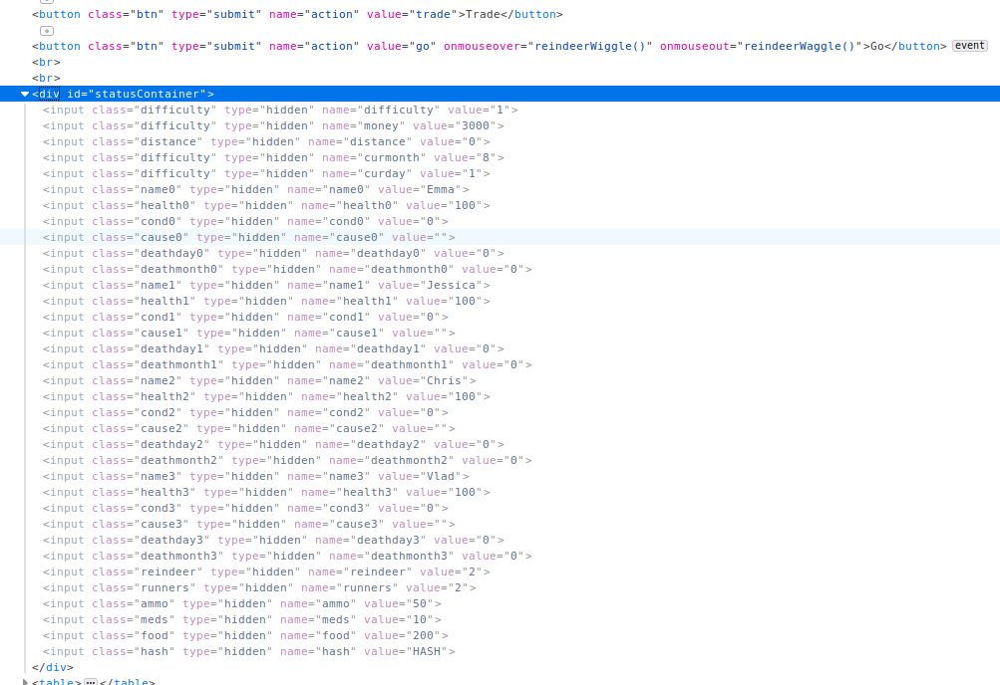

All the hidden values are related to the game values, so again we can change the distance value to 8000, and press `GO` in game:

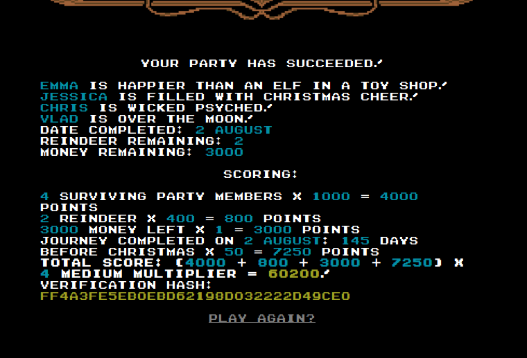

Again, we finished the game in one step. 

Alternatively this difficulty can also be won by editing a new POST request with the distance value changed to 8000, and send over to the server.

Lastly on the hard difficulty, the hint mentions that there is a hash integrity added to ensure no cheating. So if we check the page source again we will see an additional value:

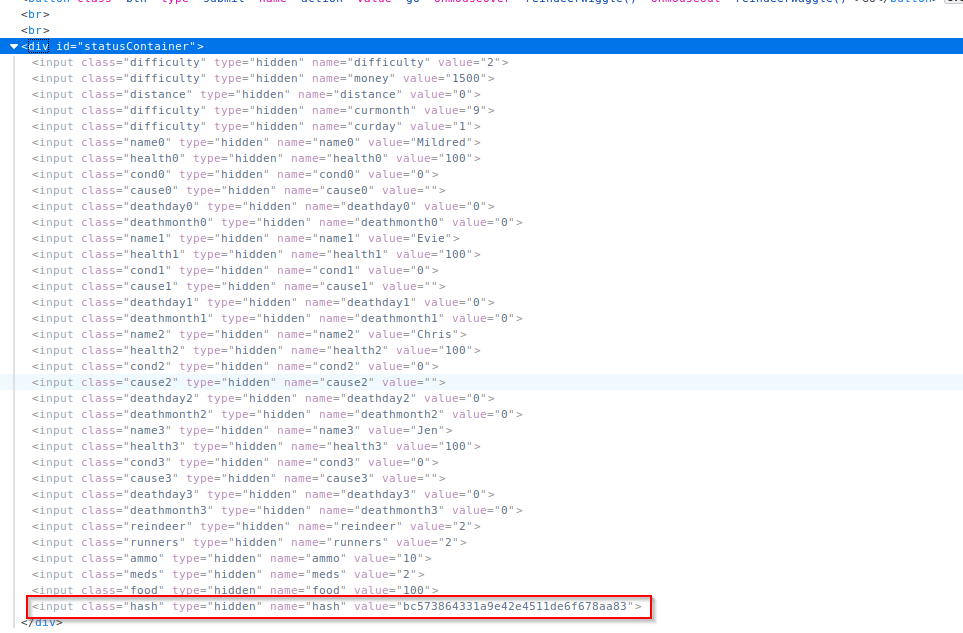

This means that any value we change to the game values will render this hash different, which will not allow the game to proceed like in the medium difficulty.  
The way to counter this would be to provide the correct hash value with the changed `distance=8000`

We can either bruteforce our way to find out how this hash value is generated, or we can take Minty's hint: ([Web Apps: A Trailhead](https://youtu.be/0T6-DQtzCgM)) and check out how the hash value is been generated

In summary, the hash is made up by doing a summation on the values of money, distance, curmonth, curday, reindeer, runners, ammo, meds, and food.  
At the start, the summation of those values = 1626, giving us the hash `bc573864331a9e42e4511de6f678aa83`  
now we add distance=8000, so the summation = 9626, giving us the hash `649d45bf179296e31731adfd4df25588`

we change the values of distance and hash accordingly, and press `GO`:

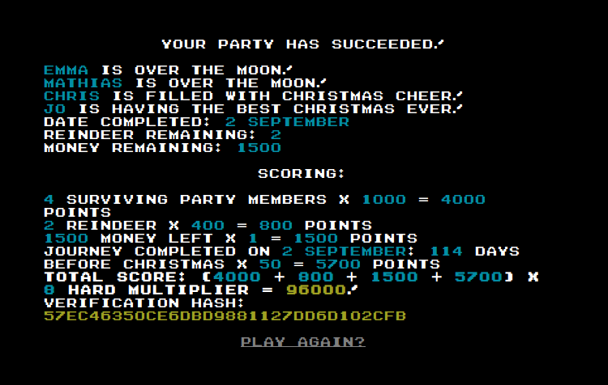

We got all the difficulties solved.

## Solution(main problem):

After completing the game on any difficulty, Minty Candy Cane will give us the following hints for the main problem:

> [Optical Decoding of Keys](https://www.youtube.com/watch?v=KU6FJnbkeLA&feature=youtu.be)  
> [Deviant's Key Decoding Templates](https://github.com/deviantollam/decoding)

The video given by the hint is very important, as it tell us that any physical key can be copied by measuring the width size of each bitting on the key.  
All keys have 6 different bitting widths/positions, and that will form a `6-digit bitting value`.   With the bitting value and the key brand's pinning charts that is available publicly, we will be able us to clone a identical key.

If we go into Minty's dorm room at her right, we will find a Key grinder on the table, as well as an NPC who will go into another room on the right. 

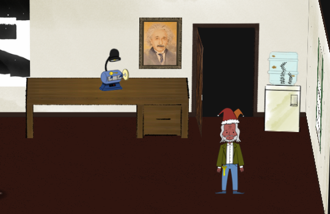

If we follow him in to the next room, All we see is an empty wall with a keyhole.

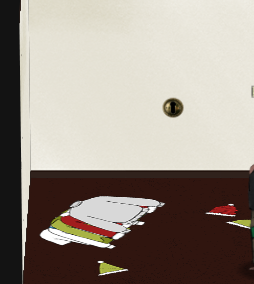

What we need to do here is to check developer's tool on the web browser, and check the `network` tab. Then we go back to the dorm room with the key grinder to see the npc again. This time on the `network` tab, we can see a png file called `krampus.png`. If we zoom in we'll see a key on him.

Here is [the png file of the krampus](./res/krampus.png).

Looks like we need to clone another identical key to use on the keyhole we found in the next room to reveal the steam tunnels. So let's open an image editor (**I will be using GIMP**) and check out the key and its properties.

First we need to rotate the krampus.png and enlarge him. We will see that the key brand belongs to **Schlage**, if we compare against [Deviant's Key Decoding Template](./decoding/Key\ Decoding/) provided. So let's overlay [Schlage's Key Decoding](./decoding/Key\ Decoding/Decoding\ -\ Schlage.png) over the krampu's key.

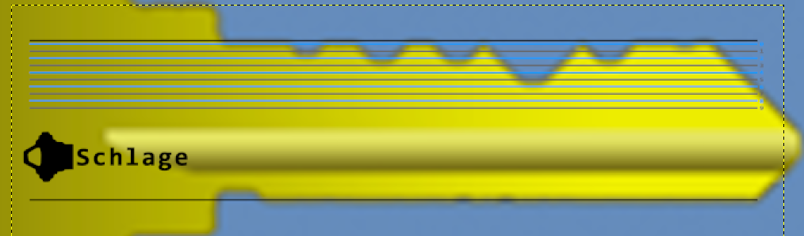

It might look very blur with all the scaling of both images, but eventually we'll be able to find the 6-digit bitting value: **122520**

With that, we can go to the key grinder and clone ourself the key:

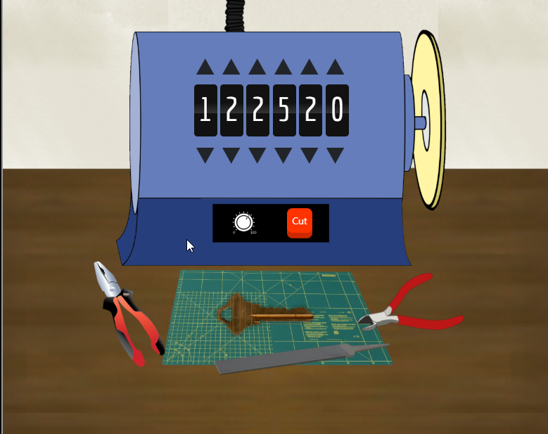

Then we click on the key to save a .png image of it.

Move on to the next room and click on the keyhole. Then click on the keys at the top left, which will ask us for the key we just created:

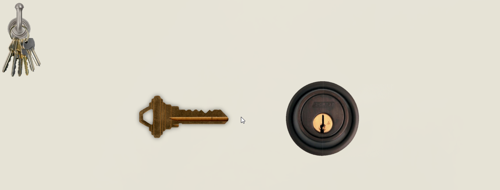

We should see a key being uploaded at our mouse cursor as shown above. Use the key on the keyhole, and we'll be able to unlock the tunnels:

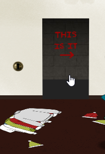

Make our way into the tunnel, and find the NPC krampus:

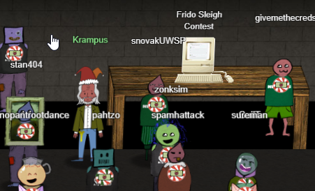

Interact with him and we'll get his full name as the answer for this objective: **Krampus Hollyfeld**

