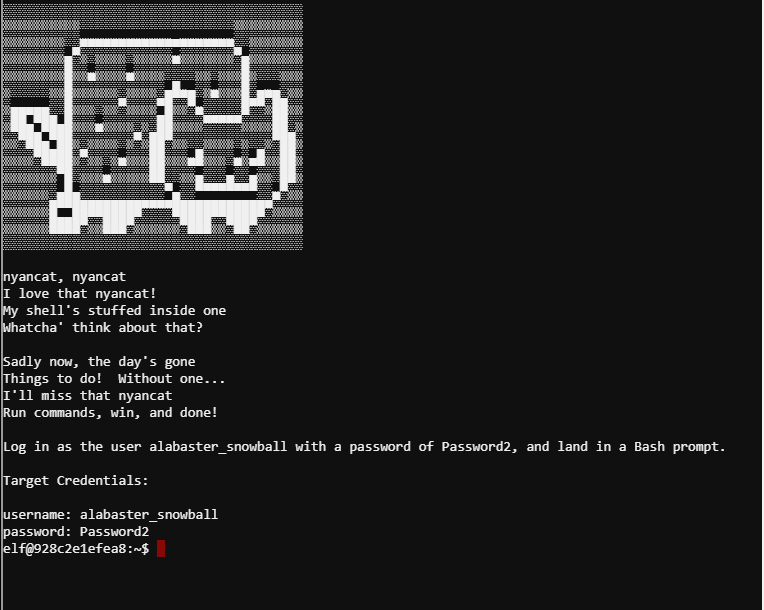
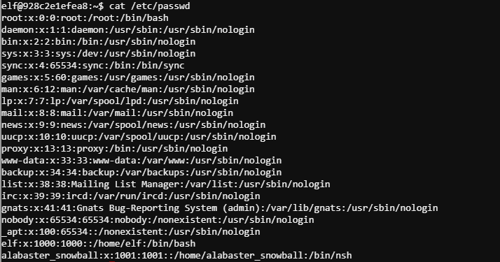
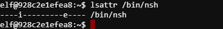
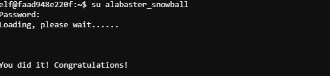

## Problem Statement:

> 8) Bypassing the Frido Sleigh CAPTEHA  
> Difficulty: 4/5  
> Help Krampus beat the Frido Sleigh contest. For hints on achieving this objective, please talk with Alabaster Snowball in the Speaker Unpreparedness Room.

===============================================================================
## Solution(hint):

First let's visit Alabaster Snowball in the _Speaker Unpreparedness Room_ for the hint.  
He wants to login to the terminal but his bash is not working.

hint given for this sub-problem:

> On Linux, a user's shell is determined by the contents of /etc/passwd  
> sudo -l says I can run a command as root. What does it do?

Let's get into the terminal:

We get the target credentials at the terminal startup:  
> Username: alabaster_snowball  
> password Password2

Look at the user's shell location using /etc/passwd:  
`cat /etc/passwd`  

alabaster's shell is /bin/nsh instead of the usual /bin/bash. Probably the reason why he couldnt get bash.  
Running /bin/nsh will get the following:  

`Ctrl+C` to exit the /bin/nsh  
From the hint provided, we look at sudo -l:  
`sudo -l` --reveals elf's sudo permission to run `chattr` command.  
`lsattr /bin/nsh`  

Interesting, /bin/nsh is immutable with the flag -i set.  
Since we have sudo permission to run `chattr`, we can unset the -i flag and copy /bin/bash's content into /bin/nsh.  
`sudo chattr -i /bin/nsh`  
`cat /bin/bash > /bin/nsh`  
`su alabaster_snowball` --password: Password2  

## Solution(main):

Solving the hint problem will give us the following hint:

> [Machine Learning Use Cases for Cyber Security](https://www.youtube.com/watch?v=jmVPLwjm_zs&feature=youtu.be)
