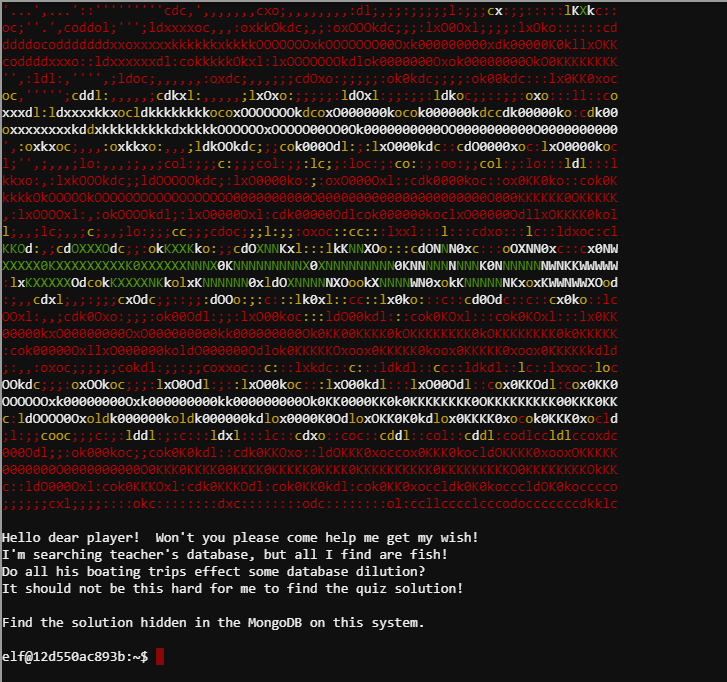
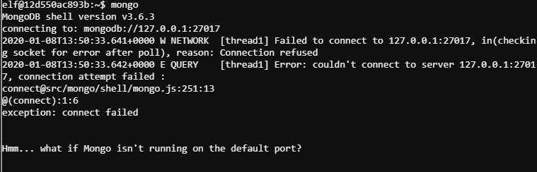
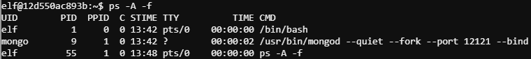
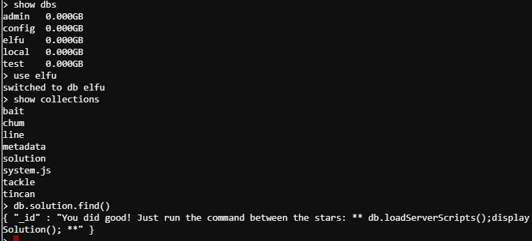

## Problem Statement:

> 10) Recover Cleartext Document  
> Difficulty: 5/5  
> The Elfscrow Crypto tool is a vital asset used at Elf University for encrypting SUPER SECRET documents. We can't send you the source, but we do have debug symbols that you can use.  
> Recover the plaintext content for this encrypted document. We know that it was encrypted on December 6, 2019, between 7pm and 9pm UTC.  
> What is the middle line on the cover page? (Hint: it's five words)

> For hints on achieving this objective, please visit the NetWars room and talk with Holly Evergreen.

===============================================================================
## Solution(hint):

First let's visit Holly Evergreen in the _NetWars Room_ for the hint.  
His teacher has been locked out of the quiz database and cannot remember the solution.
We need to help him get access back to the database for the quiz solution.

hint given for this sub-problem:

> [MongoDB Documentation](https://docs.mongodb.com/manual/reference/command/listDatabases/#dbcmd.listDatabases)

Let's get into the terminal:

We need to access the mongoDB.  
Usually we can access mongoDB that is running localhost on default port using `mongo` command:  
`mongo`  

We were told it may not be running on default port, so we have to find the port it's running on.  
Use `ps` command to find mongoDB and the port it's running on:    
`ps -A -f`  

We got our port number.  
`mongo --port 12121` -we have access to mongoDB  
`show dbs` --reveals 5 databases: admin, config, elfu, local, test  
`use elfu`  
`show collections` --reveals a collection called solution  
`db.solution.find()`   

Now we just have to run the commands as shown:  
`db.loadServerScripts();displaySolution();` --solved

## Solution(main):

Solving the hint problem gives us the following hint:

> [Reversing Crypto the Easy Way](https://www.youtube.com/watch?v=obJdpKDpFBA&feature=youtu.be)

