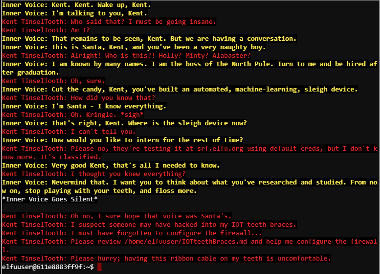
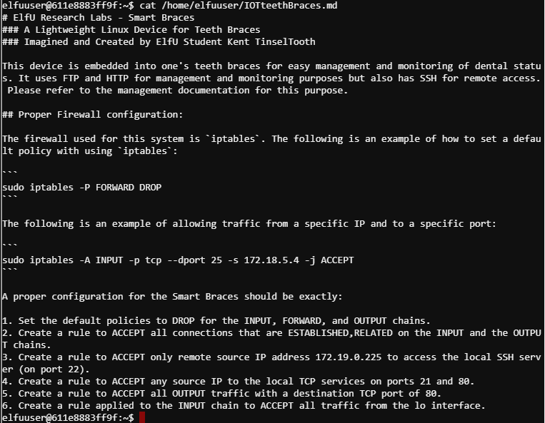

## Problem Statement:

> 11) Open the Sleigh Shop Door  
> Difficulty: 5/5  
> Visit Shinny Upatree in the Student Union and help solve their problem. What is written on the paper you retrieve for Shinny?  
> For hints on achieving this objective, please visit the Student Union and talk with Kent Tinseltooth.

td:lr Answer: ****

===============================================================================
## Solution(hint):

First let's visit Kent Tinseltooth at _Student Union_ for the hint.  
Kent wants us to reconfigure the firewall using iptables.

hint given for this sub-problem:

> [Iptables](https://upcloud.com/community/tutorials/configure-iptables-centos/)

Let's get into the terminal:

`cat /home/elfuuser/IOTteethBraces.md`

We need to configure according to the requirements stated:

Input following commands to configure the requirements:  
`sudo iptables -P INPUT DROP`  
`sudo iptables -P OUTPUT DROP`  
`sudo iptables -P FORWARD DROP`  
`sudo iptables -A INPUT -m conntrack --ctstate ESTABLISHED,RELATED -j ACCEPT`  
`sudo iptables -A OUTPUT -m conntrack --ctstate ESTABLISHED,RELATED -j ACCEPT`  
`sudo iptables -A INPUT -p tcp --dport 22 -s 172.19.0.225 -j ACCEPT`  
`sudo iptables -A INPUT -p tcp --dport 21 -j ACCEPT`  
`sudo iptables -A INPUT -p tcp --dport 80 -j ACCEPT`  
`sudo iptables -A OUTPUT -p tcp --dport 80 -j ACCEPT`  
`sudo iptables -A INPUT -i lo -j ACCEPT` 

## Solution(main):

Kent will provide the following hints:  
> [Chrome Dev Tools](https://developers.google.com/web/tools/chrome-devtools)  
> [Firefox Dev Tools](https://developer.mozilla.org/en-US/docs/Tools)  
> [Safari Dev Tools](https://developer.apple.com/safari/tools/)  
> [Curl Dev Tools](https://curl.haxx.se/docs/manpage.html)  
> [Edge Dev Tools](https://docs.microsoft.com/en-us/microsoft-edge/devtools-guide/console)  
> [Edge Dev Tools](https://xkcd.com/325/)  
As well as a hint that completing the trail challenge on HARD difficulty will give a hint too.  
Completing the hard difficulty will give the following hint in Dev Tools:  

