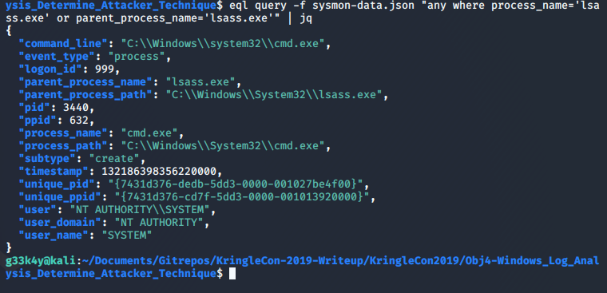
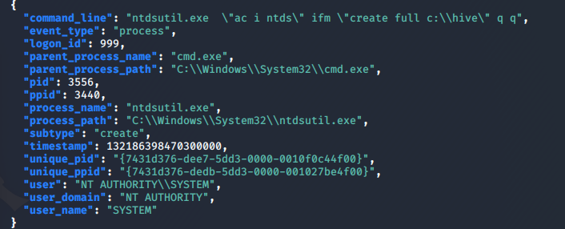

## Problem Statement:

> 4) Windows Log Analysis: Determine Attacker Technique

> Difficulty: 2/5

> Using [these normalized Sysmon logs](./sysmon-data.json.zip), identify the tool the attacker used to retrieve domain password hashes from the lsass.exe process. For hints on achieving this objective, please visit Hermey Hall and talk with SugarPlum Mary.

td:lr Answer: **ntdsutil**

===============================================================================
## Solution(hint):

First let's visit SugarPlum Mary at Hermey Hall for the hint.

She wants to get a listing of files in her `home/` directory using `ls` command, but the command does not work. Seems like the real `ls` command is missing.

hint given for this sub-problem:

> Green words matter, files must be found, and the terminal's $PATH matters.

First let's try the `ls` command and see what's the issue:

Ok it is not working as expected. 
Likely the command is hidden at another location.
We should take a look at where this fake `ls` command is.

`which ls`

The fake `ls` command is found at `/usr/local/bin/ls`.

`cd /usr/local/bin/` without pressing <enter>, press <tab> twice

interesting, there's a hidden folder `.things/` at the same location, we should look within.

`cd /usr/local/bin/.things/` without pressing _enter_, instead we press _tab_ twice to get an autocomplete 

`cd /usr/local/bin/.things/success`

but the above command will not work since it is not a directory, therefore we should change the command from `cd` to `file` to see what this file is

`file /usr/local/bin/.things/success`

It is a 64-bit binary file. Let's try running it:

`cd /usr/local/bin/.things/`

`./success`

Got it! :)

## Solution(main problem):

**this is done using Kali Linux**

After helping with his task, he will provide hints for the problem statement:

> [EQL Threat Hunting](https://pen-testing.sans.org/blog/2019/12/10/eql-threat-hunting/)

> [Sysmon By Carlos Perez](https://www.darkoperator.com/blog/2014/8/8/sysinternals-sysmon)

We will need to download 2 things:

1. [Event Query Language(eql)](https://github.com/endgameinc/eql) - for processing and querying the Sysmon logs.
2. [Sysmon logs](./sysmon-data.json.zip), given by the objective.

on Kali linux, you can install eql easily using the following command:
`pip3 install eql`

unzip the Sysmon logs. Good thing is the logs are already normalised, otherwise we will need to use `eqllib` to convert the data to a normalised form.

To find the information we need, we first look for `process_name='lsass.exe' or parent_process = 'lsass.exe'`, as given in the problem statement:

`eql query -f sysmon-data.json "any where process_name='lsass.exe' or parent_process_name='lsass.exe'" | jq`

we will get a logon_id which uses lsass.exe. So let's pivot from there to see what else the user did:

`eql query -f sysmon-data.json "any where logon_id=999" | jq`

Here we can see that in the last process, the user uses the ntdsutil.exe to create an accessible backup of the domain password hashes. So we got our answer: **ntdsutil**

