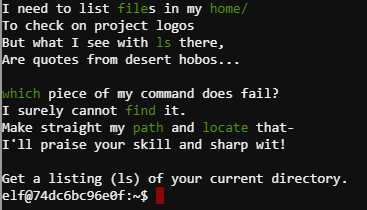
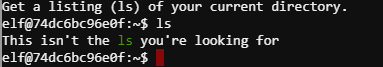
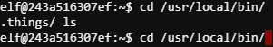
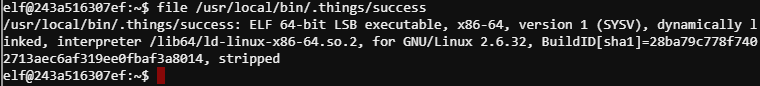
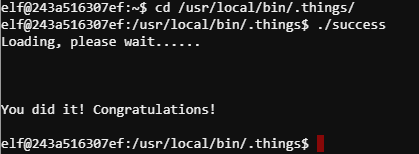

## Problem Statement:

> 4) Windows Log Analysis: Determine Attacker Technique

> Difficulty: 2/5

> Using [these normalized Sysmon logs](./sysmon-data.json.zip), identify the tool the attacker used to retrieve domain password hashes from the lsass.exe process. For hints on achieving this objective, please visit Hermey Hall and talk with SugarPlum Mary.

===============================================================================
## Solution(hint):

First let's visit SugarPlum Mary at Hermey Hall for the hint.

He wants to get a listing of files in his `home/` directory using `ls` command, but the command does not work. Seems like the real `ls` command is missing.

hint given for this sub-problem:

> Green words matter, files must be found, and the terminal's $PATH matters.

First let's try the `ls` command and see what's the issue:

Ok it is not working as expected. 
Likely the command is hidden at another location.
We should take a look at where this fake `ls` command is.

`which ls`

The fake `ls` command is found at `/usr/local/bin/ls`.

`cd /usr/local/bin/` without pressing <enter>, press <tab> twice

interesting, there's a hidden folder `.things/` at the same location, we should look within.

`cd /usr/local/bin/.things/` without pressing <enter>, press <tab> twice
we will get autocomplete `cd /usr/local/bin/.things/success`

the command will not work since it is not a directory, so we should change it to `file` to see what this file is

`file /usr/local/bin/.things/success`

It is a 64-bit binary file. Let's try running it:

`cd /usr/local/bin/.things/`
`./success`

Got it! :)

## Solution(main problem):

After helping with his task, he will provide hints for the problem statement:

> [EQL Threat Hunting](https://pen-testing.sans.org/blog/2019/12/10/eql-threat-hunting/)

> [Sysmon By Carlos Perez](https://www.darkoperator.com/blog/2014/8/8/sysinternals-sysmon)

