## Problem Statement:

> 6) Splunk

> Difficulty: 3/5

> Access [https://splunk.elfu.org/](https://splunk.elfu.org/) as elf with password elfsocks. What was the message for Kent that the adversary embedded in this attack? The SOC folks at that link will help you along! For hints on achieving this objective, please visit the Laboratory in Hermey Hall and talk with Prof. Banas.

td:lr Answer: **Kent you are so unfair. And we were going to make you the king of the Winter Carnival.**

===============================================================================
## Solution:

We are told to login to the URL provided with the following:

> Username: socks

> password: elfsocks

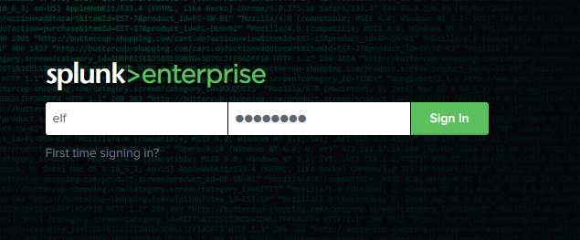

The following prompt is shown when we log in:

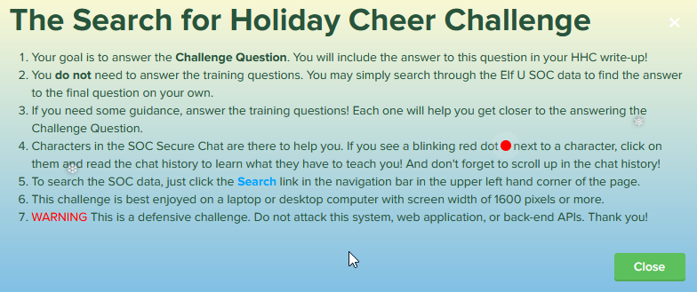

After closing the prompt, we will notice that the screen is split into two:

> left screen holds the SOC Secure Chat, where we can interact with NPCs

> right screen holds the Challenge Question and Training Questions

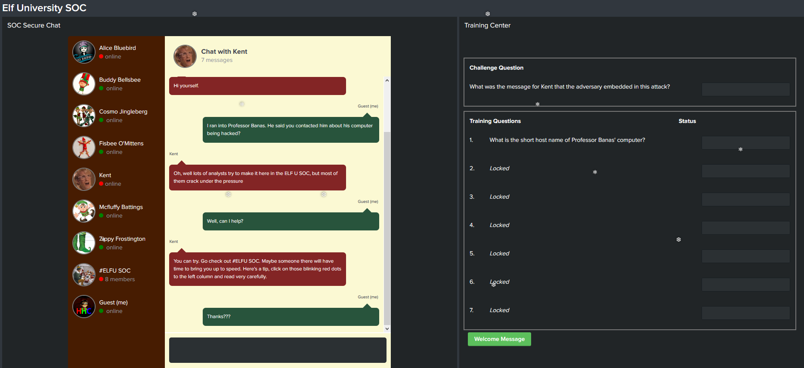

### Training Question 1

We shall go through the chat with Kent, who tells us to proceed to #ELFU SOC to hear what they have to say:

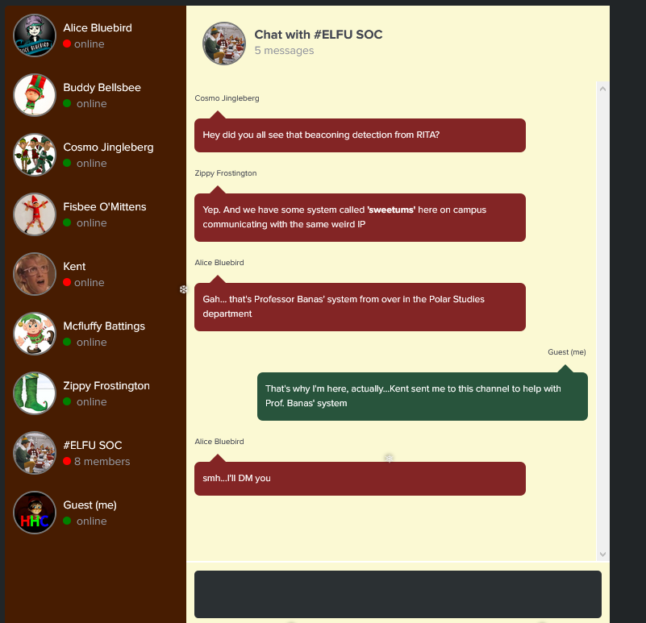

From the chat we got our answer to the first training question:

> What is the short host name of Professor Banas' computer? **sweetums**

### Training Question 2

We are given some simple background on Sysmon here:

> [A Salacious Soliloquy on Sysmon](https://www.splunk.com/en_us/blog/security/a-salacious-soliloquy-on-sysmon.html)

Next we have a long conversation with Alice Bluebird. She mentions that we should use the Search function provided at the top left to look for our answer to the next question. She provided this particular hint on what the search key should be:

> Well, I just told you who we were most worried about protecting. Maybe start with his name!

If you followed the conversation, you will know that the key person here is santa, so let's use `santa` as our search term:

`index=main santa`

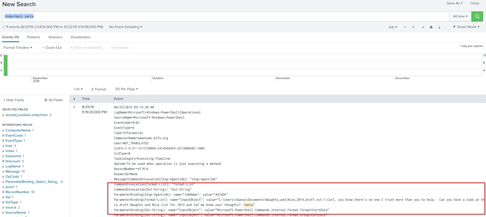

We can get our answer to training question 2 from the first event log found.

> What is the name of the sensitive file that was likely accessed and copied by the attacker Please provide the fully qualified location of the file. (Example: C:\temp\report.pdf)

> **C:\Users\cbanas\Documents\Naughty_and_Nice_2019_draft.txt**

### Training Question 3

For this part, we were told to do a search for the C2 server. An example of a search term to use to search for Sysmon data is provided:

`sourcetype=XmlWinEventLog:Microsoft-Windows-Sysmon/Operational`

we can include the below fields to narrow down our searches

`EventCode=3`

`process_name="powershell.exe"`

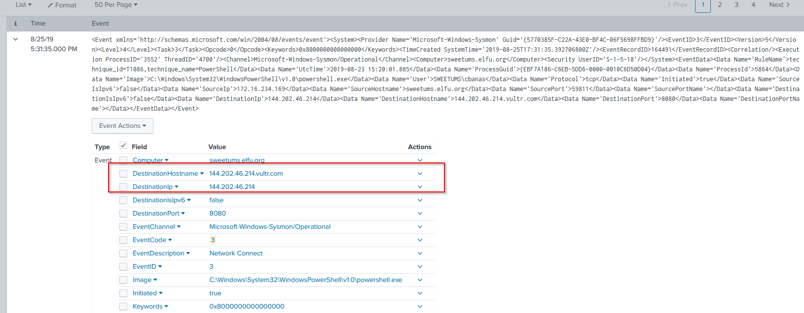

With the above search terms aggregated together, we have narrowed down the event logs, opening any one of them and look under the `DestinationHostname` will give us the answer.

> What is the fully-qualified domain name(FQDN) of the command and control(C2) server? (Example: badguy.baddies.com)

> **144.202.46.214.vultr.com**

### Training Question 4

For this time we need to do some pivoting to get our result. First we were provided with a search term in the following:

`index=main sourcetype="WinEventLog:Microsoft-Windows-Powershell/Operational" | reverse`
  
_reverse will flip the results so that the oldest event is at the top of the list._

Next we are told to look at the `Time` column in the search results, click on the date/timestamp and specify a time window of +/- 5 seconds and then apply it. We will also remove the `sourcetype` and `| reverse` from the search term:

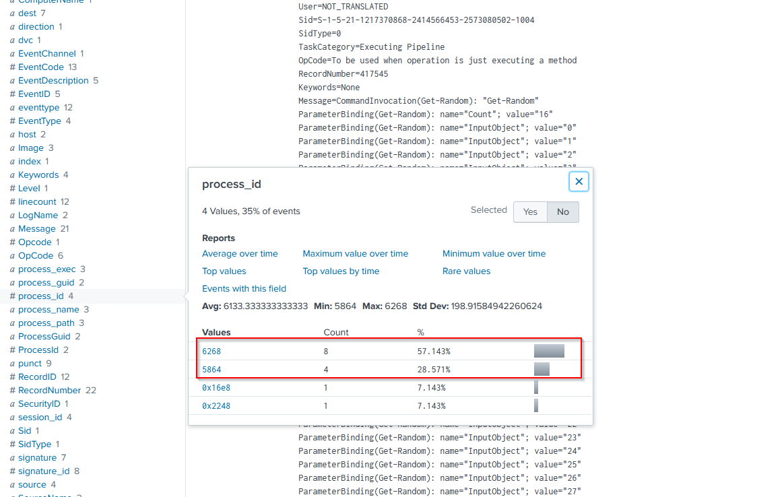

We should be able to find two separate events of different process IDs from Sysmon in this time window (processID = **5864 and 6268**). You may include `sourcetype="XmlWinEventLog:Microsoft-Windows-Sysmon/Operational"` to narrow down to Sysmon event logs.

We need to uncover what launched these processes. So we need to change our search terms as suggested by NPC Alice:

`sourcetype=WinEventLog EventCode=4688` and set time back to all time

> Windows Security Log Event ID 4688 is used for "A new process has been created"

There are too many events associated with EventCode=4688, so we should look particularly for Sysmon Logs again, given the 2 processID we found, but we need to convert them to hexadecimal first.

`processID=5864 is processID=0x16e8`

`processID=6268 is processID=0x187c`

We cannot find anything under processID=0x16e8, but we see something interesting in processID=0x187c:

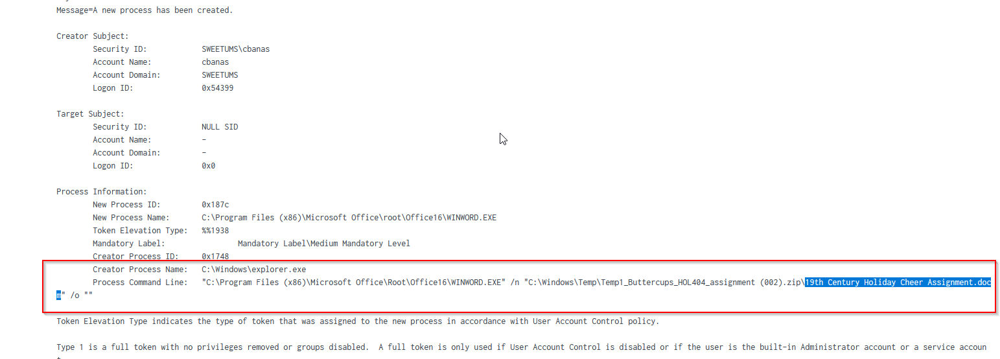

We will get our answer under `Process Command Line:`

> What document is involved with launching the malicious PowerShell code? Please provide just the filename. (Example: results.txt)

> **19th Century Holiday Cheer Assignment.docm**

### Training Question 5

For this part we are introduced to an automation framework called **stoQ**, which analyzes all email messages at Elf U. We can check out the [stoQ project home page](https://stoq.punchcyber.com/) here.

Here are also the [slides from a talk on stoQ](./summit_archive_1492181136.pdf) from the SANS DFIR Summit few years ago.

stoQ output is in JSON format, so we can run stoQ searches like the following:

`index=main sourcetype=stoq | table _time results{}.workers.smtp.to results{}.workers.smtp.from  results{}.workers.smtp.subject results{}.workers.smtp.body | sort - _time`

This will produce a table result:

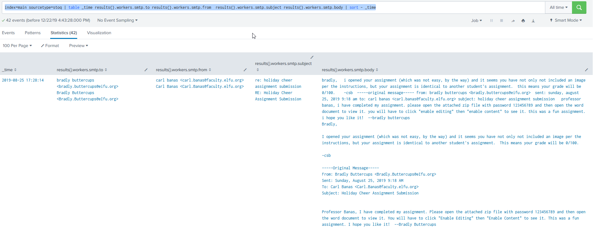

This is easy, we just need to count the unique email addresses that were used to send Holiday Cheer essays to Professor Banas.

Alternatively, we can change it to Verbose Mode, then look for Events fields where `results{}.workers.smtp.subject="Holiday cheer Assignment Submission"`

Take note not to double count the same subject titles.

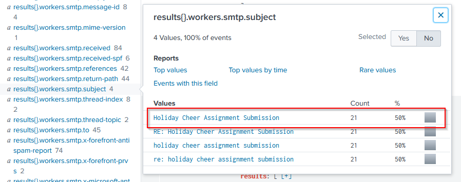

> How many unique email addresses were used to send Holiday Cheer essays to Professor Banas? Please provide the numeric value. (Example: 1)

> **21**

### Training Question 6

This part is easy, now that we have the table data, we can just narrow down our search such that the body contains the password, by using the following search term:

`index=main sourcetype=stoq  "results{}.workers.smtp.body"="*password*"`

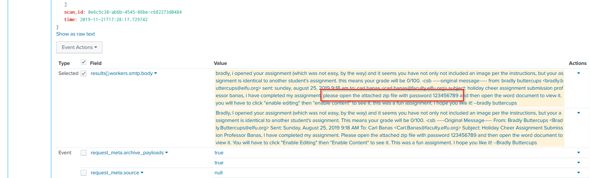

> What was the password for the zip archive that contained the suspicious file?

> **123456789**

### Training Question 7

This is also very straightaway. Since we found the suspicious file in this particular email, we just need to look for the smtp.from field for the email address that sends this email:

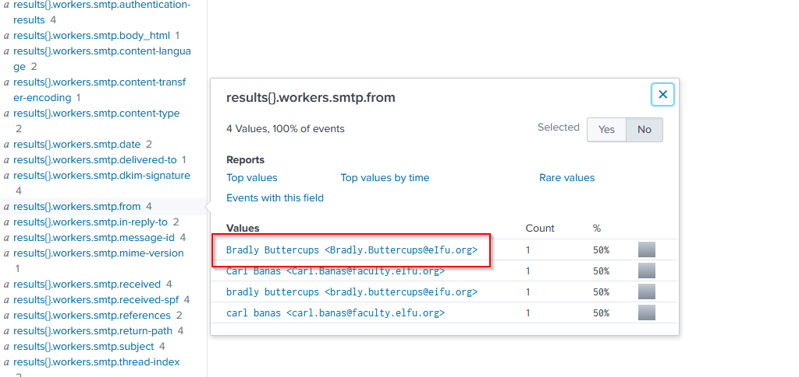

> What email address did the suspicious file come from?

> **bradly.buttercups@eifu.org**

### Challenge Question

> Fun Fact from NPC Alice: Did you know that modern Word documents are (at their core) nothing more than a bunch of .xml files?

Lastly we are finally here to find the answer to the challenge question.

NPC Alice gave us a straightforward hint with the following search term:

`index=main sourcetype=stoq  "results{}.workers.smtp.from"="bradly buttercups <bradly.buttercups@eifu.org>" | eval results = spath(_raw, "results{}") | mvexpand results | eval path=spath(results, "archivers.filedir.path"), filename=spath(results, "payload_meta.extra_data.filename"), fullpath=path."/".filename | search fullpath!="" | table filename,fullpath`

we will follow the full path of the suspicious document `19th Century Holiday Cheer Assignment.docm` and download the artifact to see what is contained within:

`http://elfu-soc.s3-website-us-east-1.amazonaws.com/?prefix=stoQ%20Artifacts/home/ubuntu/archive/c/6/e/1/7/` [artifact](./artifacts/c6e175f5b8048c771b3a3fac5f3295d2032524af)

The following is written in the artifact downloaded:

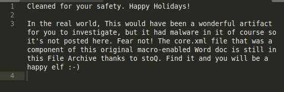

So let's look for this core.xml file instead:

`http://elfu-soc.s3-website-us-east-1.amazonaws.com/?prefix=stoQ%20Artifacts/home/ubuntu/archive/f/f/1/e/a/` [artifact](./artifacts/ff1ea6f13be3faabd0da728f514deb7fe3577cc4)

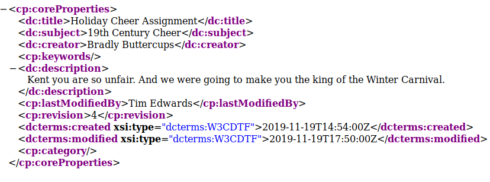

From the content, we can get our answer.

> What was the message for Kent that the adversary embedded in this attack?

> **Kent you are so unfair. And we were going to make you the king of the Winter Carnival.**

